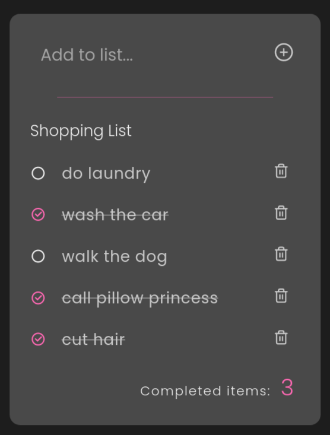

https://www.code-boost.com/react-local-storage/

## DESCRIPTION:
A simple react todo app.

## OUTCOME:
Getting used to creating React App + useState hook.

## TECH STACKS:
- React
- Hooks: useState.
- Styling: CSS with 'B.E.M' naming convention.

## PROGRESS:
- Done: 100%;

## NEXT UPDATE:
- to add "save to local storage" feature.

## How to run
`yarn install`
`yarn start`

## IMAGE:
